# @promethean-os/ai-learning

Intelligent AI model routing and performance learning system for the Promethean Framework.

## 🎯 Overview

The AI Learning System provides intelligent routing of AI tasks to optimal models based on historical performance data, task classification, and configurable routing strategies. It continuously learns from model performance to improve routing decisions over time.

## 🚀 Features

- **Task Classification**: Automatically categorizes tasks into 10 specialized categories
- **Intelligent Routing**: Multiple routing strategies (best-performance, fastest, cheapest, most-reliable, balanced)
- **Performance Tracking**: Comprehensive performance analysis with confidence metrics
- **Continuous Learning**: Adapts routing decisions based on historical performance
- **Model Management**: Dynamic model registration and capability tracking
- **Analytics**: Detailed insights into model utilization and effectiveness

## 📦 Installation

```bash
pnpm add @promethean-os/ai-learning
```

## 🔧 Quick Start

```typescript
import { AILearningSystem, type ModelCapabilities } from '@promethean-os/ai-learning';

// Initialize with available models
const models: Record<string, ModelCapabilities> = {
  'qwen3:8b': {
    maxTokens: 8192,
    supportsStreaming: true,
    supportsJson: true,
    supportsFunctionCalling: false,
    costPerToken: 0.00001,
    speed: 'fast',
    reliability: 0.85,
  },
  'gpt-oss:20b-cloud': {
    maxTokens: 32768,
    supportsStreaming: true,
    supportsJson: true,
    supportsFunctionCalling: true,
    costPerToken: 0.00005,
    speed: 'slow',
    reliability: 0.95,
  },
};

const aiSystem = new AILearningSystem({
  maxCacheSize: 1000,
  defaultStrategy: 'balanced',
});

await aiSystem.initialize(models);

// Route a task to the best model
const routing = await aiSystem.routeTask(
  'Fix this TypeScript error: Property "name" does not exist',
  { context: { jobType: 'generate', taskId: 'task-001' } },
);

console.log(`Selected model: ${routing.selectedModel}`);
console.log(`Confidence: ${routing.confidence}`);
console.log(`Reasoning: ${routing.reasoning}`);

// Record performance feedback
aiSystem.recordPerformance({
  modelName: routing.selectedModel,
  taskCategory: routing.taskCategory,
  score: 0.8,
  scoreSource: 'user-feedback',
  scoreReason: 'Successfully fixed the error',
  timestamp: new Date().toISOString(),
  executionTime: 2500,
  prompt: 'Fix this TypeScript error...',
});
```

## 🎯 Task Categories

The system automatically classifies tasks into these categories:

- `buildfix-ts-errors` - TypeScript error fixing
- `buildfix-general` - General build fixes
- `code-review` - Code review and analysis
- `tdd-analysis` - Test-driven development
- `documentation` - Documentation generation
- `refactoring` - Code refactoring suggestions
- `debugging` - Debugging assistance
- `planning` - Development planning
- `security` - Security analysis
- `general` - General AI tasks

## 🛣️ Routing Strategies

### `best-performance`

Selects the model with the highest historical performance score for the task category.

### `fastest`

Prioritizes response speed over other factors.

### `cheapest`

Selects the most cost-effective model per token.

### `most-reliable`

Chooses the model with the highest reliability score.

### `balanced` (default)

Uses a weighted combination of performance, speed, cost, and reliability.

## 📊 Performance Tracking

The system tracks comprehensive performance metrics:

```typescript
// Get model-specific performance
const performance = aiSystem.getModelPerformance('qwen3:8b', 'buildfix-ts-errors');
console.log(`Average score: ${performance.averageScore}`);
console.log(`Success rate: ${performance.successRate}`);
console.log(`Confidence: ${performance.confidence}`);

// Get system-wide analysis
const analysis = aiSystem.getPerformanceAnalysis();
console.log(`Total entries: ${analysis.totalEntries}`);
console.log(`Recommendations:`, analysis.recommendations);

// Get learning metrics
const metrics = aiSystem.getLearningMetrics();
console.log(`Performance trend: ${metrics.performanceTrend}`);
```

## 🔍 Advanced Usage

### Custom Routing with Context

```typescript
const routing = await aiSystem.routeTask('Review this React component for performance issues', {
  strategy: 'best-performance',
  availableModels: ['qwen3:14b', 'gpt-oss:20b-cloud'],
  context: {
    jobType: 'generate',
    messages: [{ role: 'user', content: 'Please review this component...' }],
    taskId: 'review-001',
  },
});
```

### Batch Performance Recording

```typescript
const scores = [
  {
    modelName: 'qwen3:8b',
    taskCategory: 'buildfix-ts-errors',
    score: 0.8,
    scoreSource: 'user-feedback' as const,
    timestamp: new Date().toISOString(),
    executionTime: 2500,
  },
  // ... more scores
];

aiSystem.recordPerformanceBatch(scores);
```

### System Health Monitoring

```typescript
const health = aiSystem.getSystemHealth();
console.log('System Health:', {
  initialized: health.isInitialized,
  totalModels: health.totalModels,
  totalEntries: health.totalPerformanceEntries,
  averageConfidence: health.averageConfidence,
});
```

### Data Export/Import

```typescript
// Export learning data
const data = aiSystem.exportData();
// Save to file or database...

// Import learning data
aiSystem.importData({
  performanceScores: data.performanceScores,
  modelCapabilities: data.modelCapabilities,
});
```

## 📈 Integration Examples

### With Ollama Queue

```typescript
// In your ollama-queue implementation
const routing = await aiSystem.routeTask(prompt, {
  context: { jobType, messages, taskId },
});

// Submit job with selected model
const jobId = await ollamaQueue.submitJob({
  modelName: routing.selectedModel,
  jobType,
  prompt,
  // ... other options
});

// Record performance when job completes
const result = await ollamaQueue.getJobResult(jobId);
aiSystem.recordPerformance({
  modelName: routing.selectedModel,
  taskCategory: routing.taskCategory,
  score: result.success ? 0.8 : -0.5,
  scoreSource: 'auto-eval',
  timestamp: new Date().toISOString(),
  executionTime: result.executionTime,
});
```

### With BuildFix System

```typescript
// Route BuildFix tasks intelligently
const routing = await aiSystem.routeTask(errorContext, {
  strategy: 'best-performance',
  context: { jobType: 'generate', taskId: errorId },
});

// Use the selected model for fixing
const fixResult = await applyFix(routing.selectedModel, errorContext);

// Record the outcome
a iSystem.recordPerformance({
  modelName: routing.selectedModel,
  taskCategory: 'buildfix-ts-errors',
  score: fixResult.success ? 0.9 : -0.3,
  scoreSource: 'deterministic',
  scoreReason: fixResult.reason,
  timestamp: new Date().toISOString(),
  executionTime: fixResult.executionTime,
});
```

## 🛠️ API Reference

### Classes

#### `AILearningSystem`

Main orchestrator class for AI learning and routing.

**Methods:**

- `initialize(models)` - Initialize with available models
- `routeTask(prompt, options?)` - Route task to optimal model
- `recordPerformance(score)` - Record single performance score
- `recordPerformanceBatch(scores)` - Record multiple scores
- `getModelPerformance(modelName, category?)` - Get model performance
- `queryPerformance(query)` - Query performance data
- `getPerformanceAnalysis()` - Get comprehensive analysis
- `getLearningMetrics()` - Get learning metrics
- `getRoutingStatistics()` - Get routing statistics
- `getSystemHealth()` - Get system health status
- `exportData()` - Export learning data
- `importData(data)` - Import learning data

#### `TaskClassifier`

Static methods for task classification.

**Methods:**

- `classifyTask(prompt, context?)` - Classify task into category
- `getAllCategories()` - Get all available categories
- `getClassificationScores(prompt, context?)` - Get classification scores

#### `PerformanceTracker`

Tracks and analyzes model performance.

**Methods:**

- `recordScore(score)` - Record performance score
- `getScores(query)` - Get filtered scores
- `getModelPerformance(modelName, category?)` - Get model analysis
- `getPerformanceAnalysis()` - Get comprehensive analysis

#### `ModelRouter`

Intelligent model routing logic.

**Methods:**

- `selectBestModel(prompt, options?)` - Select optimal model
- `registerModel(name, capabilities)` - Register model
- `getRoutingStatistics()` - Get routing stats

### Types

#### `ModelCapabilities`

```typescript
type ModelCapabilities = {
  maxTokens: number;
  supportsStreaming: boolean;
  supportsJson: boolean;
  supportsFunctionCalling: boolean;
  costPerToken: number;
  speed: 'fast' | 'medium' | 'slow';
  reliability: number; // 0 to 1
};
```

#### `AIPerformanceScore`

```typescript
type AIPerformanceScore = {
  score: number; // -1 to 1
  scoreSource: 'deterministic' | 'user-feedback' | 'auto-eval';
  scoreReason?: string;
  taskCategory: TaskCategory;
  executionTime?: number;
  tokensUsed?: number;
  modelName: string;
  timestamp: string;
  prompt?: string;
  result?: any;
};
```

#### `AIRoutingDecision`

```typescript
type AIRoutingDecision = {
  taskId?: string;
  prompt: string;
  taskCategory: TaskCategory;
  selectedModel: string;
  alternativeModels: string[];
  confidence: number; // 0 to 1
  reasoning: string;
  timestamp: string;
  expectedPerformance: number;
  riskLevel: 'low' | 'medium' | 'high';
};
```

## 🧪 Testing

Run the example to see the system in action:

```bash
pnpm tsx packages/ai-learning/example.ts
```

## 📚 Documentation

- **[Vector Compression Research](./docs/vector-compression-research.md)** - Comprehensive analysis of cutting-edge vector compression solutions for improving Eidolon field integration performance
- **[Eidolon Field Integration Status](./EIDOLON_FIELD_INTEGRATION_STATUS.md)** - Current status and implementation details for Eidolon field classification

## 🤝 Contributing

This package is part of the Promethean Framework. Please follow the contribution guidelines in the main repository.

## 📄 License

MIT License - see LICENSE file in the main repository.

## Promethean Packages (Remote READMEs)

- Back to [riatzukiza/promethean](https://github.com/riatzukiza/promethean#readme)

<!-- BEGIN: PROMETHEAN-PACKAGES-READMES -->
- [riatzukiza/agent-os-protocol](https://github.com/riatzukiza/agent-os-protocol#readme)
- [riatzukiza/ai-learning](https://github.com/riatzukiza/ai-learning#readme)
- [riatzukiza/apply-patch](https://github.com/riatzukiza/apply-patch#readme)
- [riatzukiza/auth-service](https://github.com/riatzukiza/auth-service#readme)
- [riatzukiza/autocommit](https://github.com/riatzukiza/autocommit#readme)
- [riatzukiza/build-monitoring](https://github.com/riatzukiza/build-monitoring#readme)
- [riatzukiza/cli](https://github.com/riatzukiza/cli#readme)
- [riatzukiza/clj-hacks-tools](https://github.com/riatzukiza/clj-hacks-tools#readme)
- [riatzukiza/compliance-monitor](https://github.com/riatzukiza/compliance-monitor#readme)
- [riatzukiza/dlq](https://github.com/riatzukiza/dlq#readme)
- [riatzukiza/ds](https://github.com/riatzukiza/ds#readme)
- [riatzukiza/eidolon-field](https://github.com/riatzukiza/eidolon-field#readme)
- [riatzukiza/enso-agent-communication](https://github.com/riatzukiza/enso-agent-communication#readme)
- [riatzukiza/http](https://github.com/riatzukiza/http#readme)
- [riatzukiza/kanban](https://github.com/riatzukiza/kanban#readme)
- [riatzukiza/logger](https://github.com/riatzukiza/logger#readme)
- [riatzukiza/math-utils](https://github.com/riatzukiza/math-utils#readme)
- [riatzukiza/mcp](https://github.com/riatzukiza/mcp#readme)
- [riatzukiza/mcp-dev-ui-frontend](https://github.com/riatzukiza/mcp-dev-ui-frontend#readme)
- [riatzukiza/migrations](https://github.com/riatzukiza/migrations#readme)
- [riatzukiza/naming](https://github.com/riatzukiza/naming#readme)
- [riatzukiza/obsidian-export](https://github.com/riatzukiza/obsidian-export#readme)
- [riatzukiza/omni-tools](https://github.com/riatzukiza/omni-tools#readme)
- [riatzukiza/opencode-hub](https://github.com/riatzukiza/opencode-hub#readme)
- [riatzukiza/persistence](https://github.com/riatzukiza/persistence#readme)
- [riatzukiza/platform](https://github.com/riatzukiza/platform#readme)
- [riatzukiza/plugin-hooks](https://github.com/riatzukiza/plugin-hooks#readme)
- [riatzukiza/report-forge](https://github.com/riatzukiza/report-forge#readme)
- [riatzukiza/security](https://github.com/riatzukiza/security#readme)
- [riatzukiza/shadow-conf](https://github.com/riatzukiza/shadow-conf#readme)
- [riatzukiza/snapshots](https://github.com/riatzukiza/snapshots#readme)
- [riatzukiza/test-classifier](https://github.com/riatzukiza/test-classifier#readme)
- [riatzukiza/test-utils](https://github.com/riatzukiza/test-utils#readme)
- [riatzukiza/utils](https://github.com/riatzukiza/utils#readme)
- [riatzukiza/worker](https://github.com/riatzukiza/worker#readme)
<!-- END: PROMETHEAN-PACKAGES-READMES -->

<!-- READMEFLOW:BEGIN -->
# @promethean-os/ai-learning

AI learning system for intelligent model routing and performance tracking

[TOC]


## Install

```bash
pnpm -w add -D @promethean-os/ai-learning
```

## Quickstart

```ts
// usage example
```

## Commands

- `build`
- `test`
- `clean`
- `dev`
- `lint`
- `typecheck`


### Package graph

```mermaid
flowchart LR
  _promethean_os_agent_os_protocol["@promethean-os/agent-os-protocol\n1.0.0"]
  _promethean_os_ai_learning["@promethean-os/ai-learning\n0.1.0"]
  _promethean_os_apply_patch["@promethean-os/apply-patch\n0.0.1"]
  _promethean_os_auth_service["@promethean-os/auth-service\n0.1.0"]
  _promethean_os_autocommit["@promethean-os/autocommit\n0.1.0"]
  _promethean_os_benchmark["@promethean-os/benchmark\n0.1.0"]
  _promethean_os_broker["@promethean-os/broker\n0.0.1"]
  _promethean_os_build_monitoring["@promethean-os/build-monitoring\n0.1.0"]
  _promethean_os_cephalon["@promethean-os/cephalon\n0.0.1"]
  _promethean_os_cli["@promethean-os/cli\n0.0.1"]
  _promethean_os_compaction["@promethean-os/compaction\n0.0.1"]
  _promethean_os_compiler["@promethean-os/compiler\n0.0.1"]
  _promethean_os_compliance_monitor["@promethean-os/compliance-monitor\n0.1.0"]
  _promethean_os_cookbookflow["@promethean-os/cookbookflow\n0.1.0"]
  _promethean_os_data_stores["@promethean-os/data-stores\n0.0.1"]
  _promethean_os_discord["@promethean-os/discord\n0.0.1"]
  _promethean_os_dlq["@promethean-os/dlq\n0.0.1"]
  _promethean_os_docs_system["@promethean-os/docs-system\n0.1.0"]
  _promethean_os_ds["@promethean-os/ds\n0.0.1"]
  _promethean_os_ecosystem_dsl["@promethean-os/ecosystem-dsl\n0.1.0"]
  _promethean_os_effects["@promethean-os/effects\n0.0.1"]
  _promethean_os_eidolon_field["@promethean-os/eidolon-field\n0.0.1"]
  _promethean_os_embedding["@promethean-os/embedding\n0.0.1"]
  _promethean_os_embedding_cache["@promethean-os/embedding-cache\n0.0.1"]
  _promethean_os_enso_agent_communication["@promethean-os/enso-agent-communication\n0.1.0"]
  _promethean_os_enso_browser_gateway["@promethean-os/enso-browser-gateway\n0.0.1"]
  _promethean_os_enso_protocol["@promethean-os/enso-protocol\n0.1.0"]
  _promethean_os_event["@promethean-os/event\n0.0.1"]
  _promethean_os_event_hooks_plugin["@promethean-os/event-hooks-plugin\n0.1.0"]
  _promethean_os_examples["@promethean-os/examples\n0.0.1"]
  _promethean_os_file_indexer["@promethean-os/file-indexer\n0.0.1"]
  _promethean_os_file_indexer_service["@promethean-os/file-indexer-service\n0.0.1"]
  _promethean_os_file_watcher["@promethean-os/file-watcher\n0.1.0"]
  _promethean_os_frontend["@promethean-os/frontend\n0.1.0"]
  _promethean_os_frontend_service["@promethean-os/frontend-service\n0.0.1"]
  _promethean_os_fs["@promethean-os/fs\n0.0.1"]
  _promethean_os_fsm["@promethean-os/fsm\n0.1.0"]
  _promethean_os_generator["@promethean-os/generator\n0.1.0"]
  _promethean_os_github_sync["@promethean-os/github-sync\n0.1.0"]
  health_service["health-service\n0.0.1"]
  heartbeat_service["heartbeat-service\n0.0.1"]
  _promethean_os_http["@promethean-os/http\n0.0.1"]
  _promethean_os_image_link_generator["@promethean-os/image-link-generator\n0.0.1"]
  indexer_client["indexer-client\n0.1.0"]
  _promethean_os_intention["@promethean-os/intention\n0.0.1"]
  _promethean_os_kanban["@promethean-os/kanban\n0.2.0"]
  _promethean_os_knowledge_graph["@promethean-os/knowledge-graph\n1.0.0"]
  _promethean_os_legacy["@promethean-os/legacy\n0.0.1"]
  _promethean_os_level_cache["@promethean-os/level-cache\n0.1.0"]
  _promethean_os_llm["@promethean-os/llm\n0.0.1"]
  _promethean_os_lmdb_cache["@promethean-os/lmdb-cache\n0.1.0"]
  _promethean_os_logger["@promethean-os/logger\n0.1.0"]
  _promethean_os_markdown["@promethean-os/markdown\n0.0.1"]
  _promethean_os_math_utils["@promethean-os/math-utils\n0.1.0"]
  _promethean_os_mcp["@promethean-os/mcp\n0.1.0"]
  _promethean_os_mcp_dev_ui_frontend["@promethean-os/mcp-dev-ui-frontend\n0.1.0"]
  _promethean_os_mcp_express_server["@promethean-os/mcp-express-server\n0.1.0"]
  _promethean_os_mcp_kanban_bridge["@promethean-os/mcp-kanban-bridge\n0.1.0"]
  _promethean_os_migrations["@promethean-os/migrations\n0.0.1"]
  _promethean_os_monitoring["@promethean-os/monitoring\n0.0.1"]
  _promethean_os_naming["@promethean-os/naming\n0.0.1"]
  _promethean_os_nl_parser["@promethean-os/nl-parser\n0.1.0"]
  _promethean_os_nlp_command_parser["@promethean-os/nlp-command-parser\n0.1.0"]
  _promethean_obsidian_export["@promethean/obsidian-export\n0.1.0"]
  _promethean_os_ollama_queue["@promethean-os/ollama-queue\n0.1.0"]
  _promethean_os_omni_tools["@promethean-os/omni-tools\n1.0.0"]
  _promethean_os_openai_server["@promethean-os/openai-server\n0.0.0"]
  _promethean_os_opencode_client["@promethean-os/opencode-client\n0.1.0"]
  _promethean_os_opencode_hub["@promethean-os/opencode-hub\n0.1.0"]
  _promethean_os_opencode_interface_plugin["@promethean-os/opencode-interface-plugin\n0.2.0"]
  _promethean_os_opencode_unified["@promethean-os/opencode-unified\n0.1.0"]
  _promethean_os_pantheon["@promethean-os/pantheon\n0.1.0"]
  _promethean_os_persistence["@promethean-os/persistence\n0.0.1"]
  _promethean_os_platform["@promethean-os/platform\n0.0.1"]
  _promethean_os_platform_core["@promethean-os/platform-core\n0.1.0"]
  _promethean_os_plugin_hooks["@promethean-os/plugin-hooks\n0.1.0"]
  _promethean_os_pm2_helpers["@promethean-os/pm2-helpers\n0.0.0"]
  _promethean_os_projectors["@promethean-os/projectors\n0.0.1"]
  _promethean_os_promethean_cli["@promethean-os/promethean-cli\n0.0.0"]
  _promethean_os_prompt_optimization["@promethean-os/prompt-optimization\n0.1.0"]
  _promethean_os_providers["@promethean-os/providers\n0.0.1"]
  _promethean_os_realtime_capture_plugin["@promethean-os/realtime-capture-plugin\n0.1.0"]
  _promethean_os_report_forge["@promethean-os/report-forge\n0.0.1"]
  _promethean_os_scar["@promethean-os/scar\n0.1.0"]
  _promethean_os_security["@promethean-os/security\n0.0.1"]
  _promethean_os_shadow_conf["@promethean-os/shadow-conf\n0.0.0"]
  _promethean_os_shadow_ui["@promethean-os/shadow-ui\n0.0.0"]
  _promethean_os_snapshots["@promethean-os/snapshots\n0.0.1"]
  _promethean_os_stream["@promethean-os/stream\n0.0.1"]
  _promethean_os_test_classifier["@promethean-os/test-classifier\n0.0.1"]
  _promethean_os_test_utils["@promethean-os/test-utils\n0.0.1"]
  _promethean_os_testgap["@promethean-os/testgap\n0.1.0"]
  _promethean_os_trello["@promethean-os/trello\n0.1.0"]
  _promethean_os_ui_components["@promethean-os/ui-components\n0.0.0"]
  _promethean_os_unified_indexer["@promethean-os/unified-indexer\n0.0.1"]
  _promethean_os_utils["@promethean-os/utils\n0.0.1"]
  _promethean_os_voice_service["@promethean-os/voice-service\n0.0.1"]
  _promethean_os_web_utils["@promethean-os/web-utils\n0.0.1"]
  _promethean_os_worker["@promethean-os/worker\n0.0.1"]
  _promethean_os_ws["@promethean-os/ws\n0.0.1"]
  _promethean_os_ai_learning --> _promethean_os_utils
  _promethean_os_ai_learning --> _promethean_os_eidolon_field
  _promethean_os_ai_learning --> _promethean_os_ollama_queue
  _promethean_os_auth_service --> _promethean_os_pm2_helpers
  _promethean_os_benchmark --> _promethean_os_utils
  _promethean_os_broker --> _promethean_os_legacy
  _promethean_os_broker --> _promethean_os_pm2_helpers
  _promethean_os_build_monitoring --> _promethean_os_utils
  _promethean_os_cephalon --> _promethean_os_embedding
  _promethean_os_cephalon --> _promethean_os_level_cache
  _promethean_os_cephalon --> _promethean_os_legacy
  _promethean_os_cephalon --> _promethean_os_llm
  _promethean_os_cephalon --> _promethean_os_persistence
  _promethean_os_cephalon --> _promethean_os_utils
  _promethean_os_cephalon --> _promethean_os_voice_service
  _promethean_os_cephalon --> _promethean_os_enso_protocol
  _promethean_os_cephalon --> _promethean_os_security
  _promethean_os_cephalon --> _promethean_os_broker
  _promethean_os_cephalon --> _promethean_os_pm2_helpers
  _promethean_os_cephalon --> _promethean_os_test_utils
  _promethean_os_cli --> _promethean_os_compiler
  _promethean_os_compaction --> _promethean_os_event
  _promethean_os_compliance_monitor --> _promethean_os_persistence
  _promethean_os_compliance_monitor --> _promethean_os_legacy
  _promethean_os_compliance_monitor --> _promethean_os_pm2_helpers
  _promethean_os_compliance_monitor --> _promethean_os_test_utils
  _promethean_os_cookbookflow --> _promethean_os_utils
  _promethean_os_data_stores --> _promethean_os_persistence
  _promethean_os_discord --> _promethean_os_pantheon
  _promethean_os_discord --> _promethean_os_effects
  _promethean_os_discord --> _promethean_os_embedding
  _promethean_os_discord --> _promethean_os_event
  _promethean_os_discord --> _promethean_os_legacy
  _promethean_os_discord --> _promethean_os_migrations
  _promethean_os_discord --> _promethean_os_persistence
  _promethean_os_discord --> _promethean_os_platform
  _promethean_os_discord --> _promethean_os_providers
  _promethean_os_discord --> _promethean_os_monitoring
  _promethean_os_discord --> _promethean_os_security
  _promethean_os_dlq --> _promethean_os_event
  _promethean_os_docs_system --> _promethean_os_kanban
  _promethean_os_docs_system --> _promethean_os_ollama_queue
  _promethean_os_docs_system --> _promethean_os_utils
  _promethean_os_docs_system --> _promethean_os_markdown
  _promethean_os_eidolon_field --> _promethean_os_persistence
  _promethean_os_eidolon_field --> _promethean_os_test_utils
  _promethean_os_embedding --> _promethean_os_legacy
  _promethean_os_embedding --> _promethean_os_platform
  _promethean_os_embedding_cache --> _promethean_os_utils
  _promethean_os_enso_agent_communication --> _promethean_os_enso_protocol
  _promethean_os_enso_browser_gateway --> _promethean_os_enso_protocol
  _promethean_os_event --> _promethean_os_test_utils
  _promethean_os_event_hooks_plugin --> _promethean_os_logger
  _promethean_os_event_hooks_plugin --> _promethean_os_persistence
  _promethean_os_event_hooks_plugin --> _promethean_os_opencode_client
  _promethean_os_examples --> _promethean_os_event
  _promethean_os_file_indexer --> _promethean_os_utils
  _promethean_os_file_indexer_service --> _promethean_os_persistence
  _promethean_os_file_indexer_service --> _promethean_os_utils
  _promethean_os_file_indexer_service --> _promethean_os_ds
  _promethean_os_file_indexer_service --> _promethean_os_fs
  _promethean_os_file_watcher --> _promethean_os_embedding
  _promethean_os_file_watcher --> _promethean_os_legacy
  _promethean_os_file_watcher --> _promethean_os_persistence
  _promethean_os_file_watcher --> _promethean_os_test_utils
  _promethean_os_file_watcher --> _promethean_os_utils
  _promethean_os_file_watcher --> _promethean_os_pm2_helpers
  _promethean_os_frontend --> _promethean_os_persistence
  _promethean_os_frontend --> _promethean_os_utils
  _promethean_os_frontend --> _promethean_os_test_utils
  _promethean_os_frontend --> _promethean_os_opencode_client
  _promethean_os_frontend_service --> _promethean_os_web_utils
  _promethean_os_fs --> _promethean_os_ds
  _promethean_os_fs --> _promethean_os_stream
  _promethean_os_github_sync --> _promethean_os_kanban
  _promethean_os_github_sync --> _promethean_os_utils
  health_service --> _promethean_os_legacy
  heartbeat_service --> _promethean_os_legacy
  heartbeat_service --> _promethean_os_persistence
  heartbeat_service --> _promethean_os_test_utils
  _promethean_os_http --> _promethean_os_event
  _promethean_os_image_link_generator --> _promethean_os_fs
  _promethean_os_kanban --> _promethean_os_lmdb_cache
  _promethean_os_kanban --> _promethean_os_markdown
  _promethean_os_kanban --> _promethean_os_utils
  _promethean_os_kanban --> _promethean_os_pantheon
  _promethean_os_level_cache --> _promethean_os_utils
  _promethean_os_level_cache --> _promethean_os_test_utils
  _promethean_os_llm --> _promethean_os_utils
  _promethean_os_llm --> _promethean_os_pm2_helpers
  _promethean_os_lmdb_cache --> _promethean_os_utils
  _promethean_os_lmdb_cache --> _promethean_os_test_utils
  _promethean_os_markdown --> _promethean_os_fs
  _promethean_os_mcp --> _promethean_os_discord
  _promethean_os_mcp --> _promethean_os_kanban
  _promethean_os_mcp_dev_ui_frontend --> _promethean_os_mcp
  _promethean_os_mcp_express_server --> _promethean_os_mcp
  _promethean_os_mcp_kanban_bridge --> _promethean_os_kanban
  _promethean_os_mcp_kanban_bridge --> _promethean_os_utils
  _promethean_os_migrations --> _promethean_os_embedding
  _promethean_os_migrations --> _promethean_os_persistence
  _promethean_os_monitoring --> _promethean_os_test_utils
  _promethean_os_nlp_command_parser --> _promethean_os_kanban
  _promethean_os_ollama_queue --> _promethean_os_utils
  _promethean_os_ollama_queue --> _promethean_os_lmdb_cache
  _promethean_os_omni_tools --> _promethean_os_mcp
  _promethean_os_omni_tools --> _promethean_os_kanban
  _promethean_os_omni_tools --> _promethean_os_logger
  _promethean_os_opencode_client --> _promethean_os_logger
  _promethean_os_opencode_client --> _promethean_os_ollama_queue
  _promethean_os_opencode_client --> _promethean_os_opencode_interface_plugin
  _promethean_os_opencode_client --> _promethean_os_persistence
  _promethean_os_opencode_interface_plugin --> _promethean_os_logger
  _promethean_os_opencode_interface_plugin --> _promethean_os_persistence
  _promethean_os_opencode_unified --> _promethean_os_security
  _promethean_os_opencode_unified --> _promethean_os_ollama_queue
  _promethean_os_opencode_unified --> _promethean_os_persistence
  _promethean_os_pantheon --> _promethean_os_persistence
  _promethean_os_persistence --> _promethean_os_embedding
  _promethean_os_persistence --> _promethean_os_legacy
  _promethean_os_persistence --> _promethean_os_logger
  _promethean_os_platform --> _promethean_os_utils
  _promethean_os_plugin_hooks --> _promethean_os_event
  _promethean_os_projectors --> _promethean_os_event
  _promethean_os_projectors --> _promethean_os_utils
  _promethean_os_prompt_optimization --> _promethean_os_level_cache
  _promethean_os_providers --> _promethean_os_platform
  _promethean_os_realtime_capture_plugin --> _promethean_os_logger
  _promethean_os_realtime_capture_plugin --> _promethean_os_persistence
  _promethean_os_realtime_capture_plugin --> _promethean_os_opencode_client
  _promethean_os_security --> _promethean_os_platform
  _promethean_os_shadow_conf --> _promethean_os_pm2_helpers
  _promethean_os_shadow_conf --> _promethean_os_pantheon
  _promethean_os_snapshots --> _promethean_os_utils
  _promethean_os_test_utils --> _promethean_os_persistence
  _promethean_os_testgap --> _promethean_os_utils
  _promethean_os_trello --> _promethean_os_kanban
  _promethean_os_trello --> _promethean_os_utils
  _promethean_os_unified_indexer --> _promethean_os_persistence
  _promethean_os_unified_indexer --> _promethean_os_test_utils
  _promethean_os_voice_service --> _promethean_os_pm2_helpers
  _promethean_os_web_utils --> _promethean_os_fs
  _promethean_os_worker --> _promethean_os_ds
  _promethean_os_ws --> _promethean_os_event
  _promethean_os_ws --> _promethean_os_monitoring
```




## Promethean Packages (Remote READMEs)

- Back to [riatzukiza/promethean](https://github.com/riatzukiza/promethean#readme)

<!-- BEGIN: PROMETHEAN-PACKAGES-READMES -->
- [riatzukiza/agent-os-protocol](https://github.com/riatzukiza/agent-os-protocol#readme)
- [riatzukiza/ai-learning](https://github.com/riatzukiza/ai-learning#readme)
- [riatzukiza/apply-patch](https://github.com/riatzukiza/apply-patch#readme)
- [riatzukiza/auth-service](https://github.com/riatzukiza/auth-service#readme)
- [riatzukiza/autocommit](https://github.com/riatzukiza/autocommit#readme)
- [riatzukiza/build-monitoring](https://github.com/riatzukiza/build-monitoring#readme)
- [riatzukiza/cli](https://github.com/riatzukiza/cli#readme)
- [riatzukiza/clj-hacks-tools](https://github.com/riatzukiza/clj-hacks-tools#readme)
- [riatzukiza/compliance-monitor](https://github.com/riatzukiza/compliance-monitor#readme)
- [riatzukiza/dlq](https://github.com/riatzukiza/dlq#readme)
- [riatzukiza/ds](https://github.com/riatzukiza/ds#readme)
- [riatzukiza/eidolon-field](https://github.com/riatzukiza/eidolon-field#readme)
- [riatzukiza/enso-agent-communication](https://github.com/riatzukiza/enso-agent-communication#readme)
- [riatzukiza/http](https://github.com/riatzukiza/http#readme)
- [riatzukiza/kanban](https://github.com/riatzukiza/kanban#readme)
- [riatzukiza/logger](https://github.com/riatzukiza/logger#readme)
- [riatzukiza/math-utils](https://github.com/riatzukiza/math-utils#readme)
- [riatzukiza/mcp](https://github.com/riatzukiza/mcp#readme)
- [riatzukiza/mcp-dev-ui-frontend](https://github.com/riatzukiza/mcp-dev-ui-frontend#readme)
- [riatzukiza/migrations](https://github.com/riatzukiza/migrations#readme)
- [riatzukiza/naming](https://github.com/riatzukiza/naming#readme)
- [riatzukiza/obsidian-export](https://github.com/riatzukiza/obsidian-export#readme)
- [riatzukiza/omni-tools](https://github.com/riatzukiza/omni-tools#readme)
- [riatzukiza/opencode-hub](https://github.com/riatzukiza/opencode-hub#readme)
- [riatzukiza/persistence](https://github.com/riatzukiza/persistence#readme)
- [riatzukiza/platform](https://github.com/riatzukiza/platform#readme)
- [riatzukiza/plugin-hooks](https://github.com/riatzukiza/plugin-hooks#readme)
- [riatzukiza/report-forge](https://github.com/riatzukiza/report-forge#readme)
- [riatzukiza/security](https://github.com/riatzukiza/security#readme)
- [riatzukiza/shadow-conf](https://github.com/riatzukiza/shadow-conf#readme)
- [riatzukiza/snapshots](https://github.com/riatzukiza/snapshots#readme)
- [riatzukiza/test-classifier](https://github.com/riatzukiza/test-classifier#readme)
- [riatzukiza/test-utils](https://github.com/riatzukiza/test-utils#readme)
- [riatzukiza/utils](https://github.com/riatzukiza/utils#readme)
- [riatzukiza/worker](https://github.com/riatzukiza/worker#readme)
<!-- END: PROMETHEAN-PACKAGES-READMES -->


<!-- READMEFLOW:END -->

<!-- PACKAGE-DOC-MATRIX:START -->

> This section is auto-generated by scripts/package-doc-matrix.ts. Do not edit manually.

## Internal Dependencies

- [@promethean-os/eidolon-field](../eidolon-field/README.md) — `orgs/riatzukiza/promethean/packages/eidolon-field`
- [@promethean-os/utils](../utils/README.md) — `orgs/riatzukiza/promethean/packages/utils`

## Internal Dependents

_None (external-only)._

_Last updated: 2025-11-16T11:25:38.889Z_

<!-- PACKAGE-DOC-MATRIX:END -->
